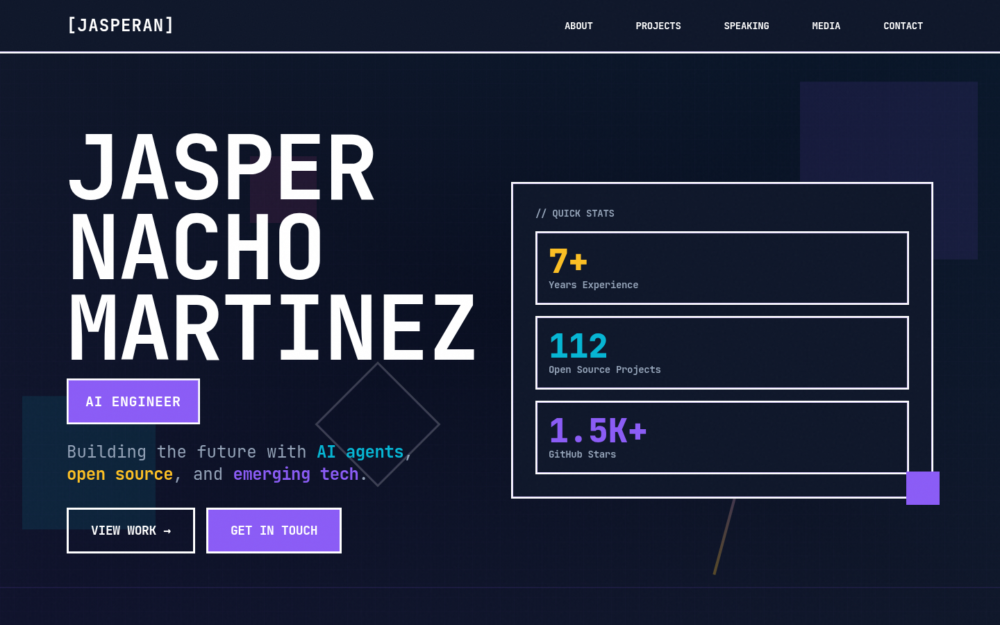
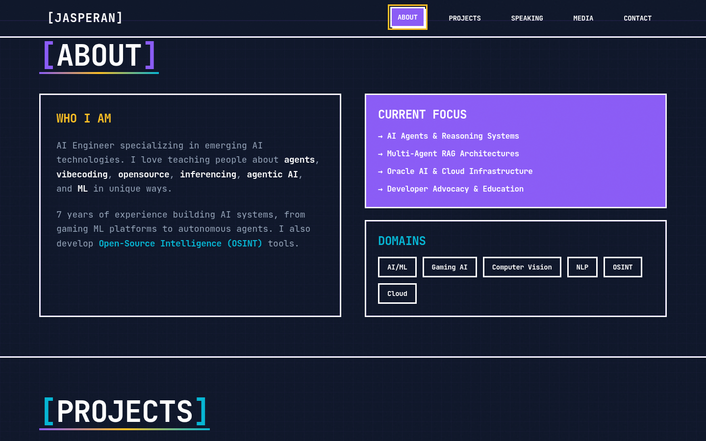
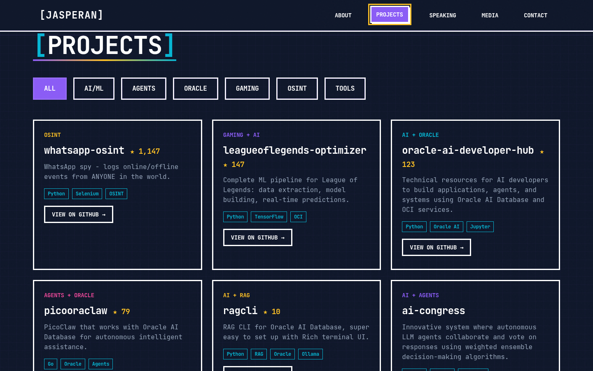
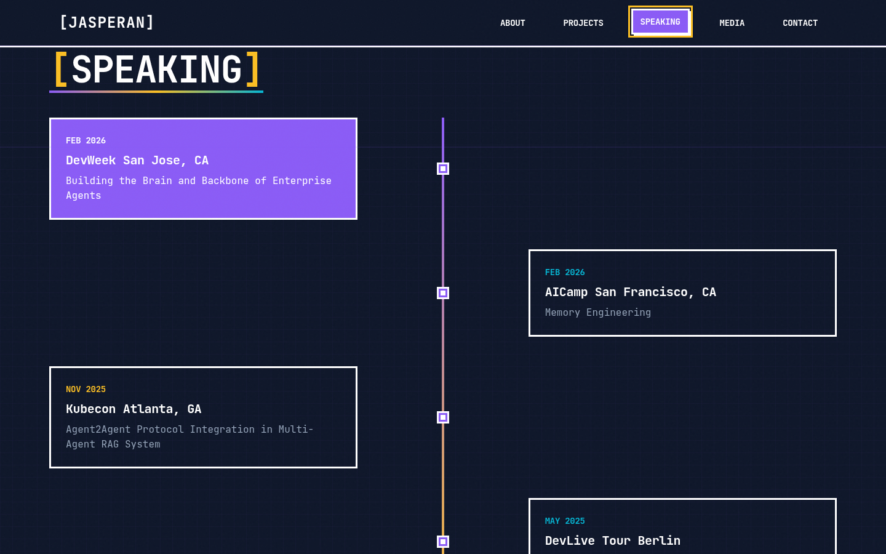
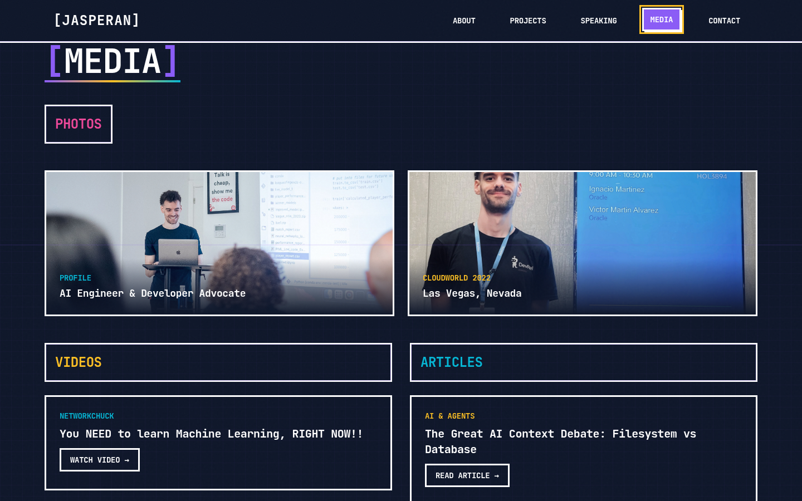
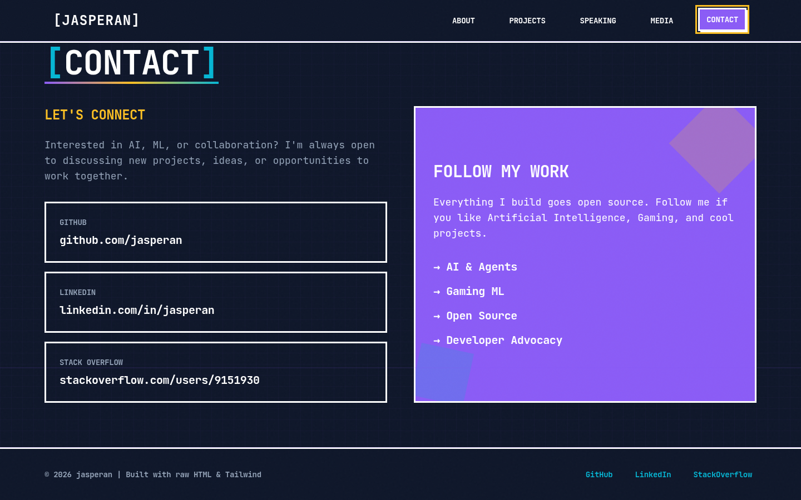

# [jasperan.github.io](https://jasperan.github.io/)

Personal portfolio site for jasperan (AI Engineer, Oracle Developer Advocate). Static HTML served via GitHub Pages.

## Screenshots













## Running Locally

```bash
git clone https://github.com/jasperan/jasperan.github.io.git
cd jasperan.github.io
python3 -m http.server 8000
# Open http://localhost:8000
```

No build step required. It's a static HTML site.

## Deployment

Pushes to `main` are served automatically by GitHub Pages at [jasperan.github.io](https://jasperan.github.io/).

## Structure

| File | Purpose |
|------|---------|
| `index.html` | Main portfolio page (self-contained HTML + Tailwind CDN) |
| `assets/` | Screenshots and images |
| `dist/` | Built assets (if any) |
